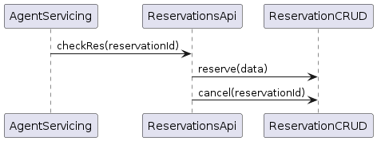

# Designing Microservices: The SEED(s) Process

The microservices design system described in this chapter is a top-down, multistep 
methodology, and a collection of reusable processes, where each later step evolves
from a previous one. Due to its evolutionary nature, we call the system Seven Essential 
Evolutions of Design for Services or SEED(S).

#### **Key Decision: Use a Standard Process for Service Design:**
*Use a standard, repeatable process to achieve consistently high-quality, customer-centric 
design for the services in your system.*  
</br>

## Introducing the Seven Evolutions of Design for Services:
</br>
<details>
<summary>1. Identifying actors</summary>
</br>
SEED(S) takes a distinctly customer-centric approach, viewing as products the services 
it is used to design. By now the “APIs are products” mantra is not particularly novel. Typical plagues of API and service design in our industry are overabstraction and lack of clarity regarding user needs. Too many APIs are simply exposures of some database tables over HTTP or an attempt to provide direct networked access into application internals, via remote procedure calls (RPCs). 

#### **Key Decision: Scope Service Design Using Key Actors**
*Start service design by identifying key actors in your domain, to achieve customer-centric 
scoping of the capabilities represented by the services.*   
</br>

There are several fundamental rules for identifying the right set of actors for your goals:
1. Identifying the boundaries of what key traits differentiate various actors of 
our design is more important than identifying an excruciating level of detail for 
who the actors are.  
2. Overlapping or too-broad actor definitions are usually red flags.  
3. These needs and behaviors that distinguish one actor type from another are relevant.  
4. Less is more—you should use as few distinct actors as possible to describe your 
problem area, but no fewer than necessary. 

### **Example Actors in Our Sample Project**  

*Frequent flyer*

	Emma travels for work, has elite loyalty status with the airline, manages her 
	travel through her work’s reservation system, and uses a number of connected 
	apps to stay on top of her busy schedule. Due to her loyalty status, she 
	is eligible for many perks. Often planning trips on short notice, when 
	traveling with family, she typically uses loyalty miles.

*Family vacationer*

    Riley and their spouse are mostly traveling for vacations with their kid(s). 
	They usually plan trips well in advance, and travel infrequently.

*Airline customer service agent*

    Sean is an experienced customer service agent assisting travelers with booking, 
	rebooking, and resolving issues during travel and after through phone and online chat.


</details> </br>
<details>
<summary>2. Identifying jobs that actors have to do</summary>
</br>  

It is important to understand the jobs that actors have to get done, and only then 
should we create a solution that best addresses their needs. Any effective API or service design methodology operates under the premise that APIs and microservices are types of products, and in their design we can successfully employ the rich *product management* toolset that has been developed over many decades.   

*Consumers of APIs* are typically frontend (web, mobile) or third-party (partner) 
applications, while *consumers of microservices* are various parts of the system itself. When beginning work with microservices, it's helpful to keep in mind that it’s the problems that are timeless; solutions change and evolve all the time.   

</br>  

#### **Key Decision: Use Jobs as the Unit of Analysis**
*Use jobs that key actors have to get done, in your domain, as the unit of analysis for 
collecting requirements.*   
</br>   

User Stories revolve around a user persona; they start with *“as a persona,”* while Job Stories disregard the persona and instead emphasize the circumstance.  The SEED(S) process identifies actors to scope the list of jobs, but at the point of describing each job for that actor, we need to identify circumstances.   
</br>   

### **Using Job Story Format to Capture *Jobs to be Done* (JTBDs)**   

For each of the actors we identify, we need to discover top JTBDs for that actor.  The SEED(S) process uses the Job Stories format as defined by [Paul Adams](https://www.intercom.com/blog-the-dribbblisation-of-design):   

*"when __circumstance__, I want to __motivation__, so I can __goal__"*  
</br> 

#### **Key Decision: Use the Standard Job Story Format**  
*Use a standard format for capturing JTBDs (known as Job Story) to uniformly capture circumstances, motivations, and goals for all your jobs.*   
</br>   

### **Example JTBDs in Our Sample Project** 

*Frequent flyer*                                                                

1. *When* __Emma’s plans change__ and she is unable to travel on a previously 
booked flight, *she wants to* __easily reschedule her flight__, *so she 
can* __get a flight that works for her new plans__.

2. *When __Emma prefers an available seat__* other than the one she has been currently 
assigned, *she wants to __select the alternative seat__*, so *she can __enjoy her flight more__*.
                                                                                
*Family vacationer*                                                             

1. *When* __Riley is planning a flight__* for their family vacation, *they want to* be able to __filter available flights with multiple criteria, including: four adjacent seats available on the flight, the number of connections, connections that go through airports that have facilities friendly to young children, etc.,__ *so that their* __family can fly with maximum comfort__.

2. *When* __Riley is planning a quick, unplanned family getaway for a long weekend__, 
*they want to* __get suggestions for interesting available trips that are affordable and a short flight__ *so they* __can have a list of choices they can consider__.
                                                                                
*Airline customer service agent*  

1. *When* __a customer calls Sean__, *he wants to* __have a servicing ticket open pre-filled with customer information__, *so he can* start tracking the progress towards the resolution of the customer need.

2. *When* __a customer is asking Sean to find them a convenient flight for their trip__, *he wants to* __be able to find a fitting flight using a flexible set of filtering criteria__, *so he can* meet the customer need and book a flight.   
</br>   

Job Stories provide a great format for conversations with subject matter experts and actual customers, but they are not convenient for deriving actual technical requirements. 

</details> </br>
<details>
<summary>3. Discovering interaction patterns with sequence diagrams</summary>
</br>

To proceed with a good design, we need to understand the service interaction patterns of our subdomain. You will want to draw an interaction diagram, explaining the sequence of events within your model.  SEED(S) recommends employing Unified Modeling Language (UML) sequence diagrams for this task.

We highly recommend using one of the Markdown-based diagramming formats, such as [PlantUML](https://plantuml.com/).

We recommend this kind of approach because modeling in a microservices team is a team activity. Using a text-based format instead of a graphical file will allow team members to:   

* Keep modeling separate from everyone’s personal choice of editor.
* Easily and effectively version-control sources of the diagrams.
* The diagrams become code and anything you can do with the code, you can now do with your diagrams as well;

##### **Key Decision: Use PlantUML Sequence Diagrams to Discover Interaction Patterns**
*To discover interaction patterns in SEED(S) methodology, we choose to use UML sequence diagrams expressed in a textual (Markdown) format such as PlantUML.*

The Job Stories and actors represent the requirements of the physical world. They do not generally map to technical interactions one-to-one. Your interaction model of the events do not necessarily have to occur between the actors described in the first step of the SEED(S) process. Neither do they have to correspond to the jobs directly. Rather, your interaction diagrams may go a level deeper and show how the user-centric requirements translate into interactions between services at a technical level.

For instance the PlantUML text may read as follows:  
```yaml
@startuml
AgentServicing -> ReservationsApi: checkRes(reservationId)
ReservationsApi -> ReservationCRUD: reserve(data)
ReservationsApi -> ReservationCRUD: cancel(reservationId)
@enduml
```   
</br>   



Once we have the sequence diagrams of the interactions, we can capture the technical requirements for a microservice, or an API, in the form of a set of actions and queries described using a standard syntax.  


</details> </br>
<details>
<summary>4. Deriving high-level actions and queries based on jobs to be done (JTBDs) and the interaction patterns</summary>
</br>
this
</details> </br>
<details>
<summary>5. Describing each query and action as a specification, with an open standard (such as the OpenAPI Specification [OAS] or GraphQL schemas)</summary>
</br>
this
</details> </br>
<details>
<summary>6. Getting feedback on the specification</summary>
</br>
this
</details> </br>
<details>
<summary>7. Implementing microservices</summary>
</br>
this
</details> </br>


